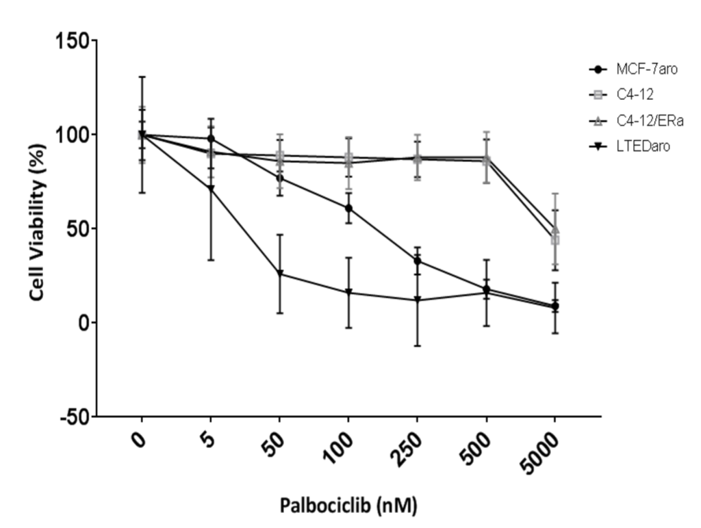

### Introduction

I selected the dataset 
[GSE114260](https://www.ncbi.nlm.nih.gov/geo/query/acc.cgi?acc=GSE114260), named 
"Effect of estrogen (E2) treatment on the C4-12 relative to the MCF7 cells" from 
a 2018 paper ["ERα-mediated cell cycle progression is an important requisite for 
CDK4/6 inhibitor response in HR+ breast 
cancer"](https://pubmed.ncbi.nlm.nih.gov/29963233/) [@petrossian2018] for this 
assignment. I chose this dataset because I did an assignment on 
the effects of estrogen receptors in Alzheimer's Disease last semester, and I 
will be doing a cancer related project in the coming summer. I wanted to 
continue on the topic of estrogen receptors and estrogen treatment and dins a 
dataset that would combine that with cancer.

On the GEO page for this study, there were two file that was linked to the paper. 
The dataset I choose had combined data from MCF-7, and the other only had the 
data for the new variants (C4-12ERaERE) that the authors used. The experiment 
was done on MCF-7aro (ER+ cell line) and C4-12ERaERE (ER lacking cell line 
transfected with transcriptionally functional ER) with human cells. The C4-12 
cell line is a variant of the MCF-7 that lacks an endogenous ER alpha (ERa) and 
was used for RNA analysis [@petrossian2018]. The treatment group was given a 
palbociclib and estrogen treatment and the control was treated with DMSO. Both 
the control and the treatment group recieved the treatment for 3 days.

The conclusion from the paper was that transcriptionally functional ER that is 
involved in cell cycle is required for CDK4/6 inhibitor response 
[@petrossian2018]. In the C4-12 cell line, they transfected the cells with a 
transcriptionally function ER, but it was shown that the ER that was transfected 
was not involved in cell proliferation. The C4-12ERaERE cell line was subjected 
to an estrogen or DMSO (control) for five days [@petrossian2018]. There was no 
change in the cell vitality in the experimental group, as shown in Supplementary 
Figure 1 below. 


The authors then used the C4-12ERaERE and MCF-7aro cell lines from the data to 
test the response to palbociclib, a CDK4/6 inhibitor. It is known that the ER in 
MCF-7aro cell line is involved in cell cycle proliferation. As shown in Figure 
1, cell proliferation was reduced in the cell lines with an active ER that 
drives cell cycle (LTEDaro is another cell line the authors used that is not in 
the data) [@petrossian2018], while there was no major effects on the C4-12ERaERE 
cells that did not have ER involved in cell cycle progression.. This signifies 
that palbociclib response is dependent on estrogen-activated ER.




### Data Downloading and Setup

5 R packages are required to produce the data: BiocManager [@BiocManager], 
GEOquery [@GEOquery], edgeR [@edgeR], biomaRt [@biomaRt], limma [@limma], 
and ggplot2 [@ggplot2]. AnnotationDbi [@AnnotationDbi], 
org.Hs.eg.db [@org.Hs.eg.db], and EnsDb.Hsapiens.v79 [@EnsDb.Hsapiens.v79] were 
later used to add Ensembl IDs to the dataset.
```{r message=FALSE}
if (!requireNamespace("BiocManager", quietly = TRUE))
    install.packages("BiocManager")
if (!requireNamespace("GEOquery", quietly = TRUE))
    BiocManager::install("GEOquery")
if (!requireNamespace("edgeR", quietly = TRUE))
    BiocManager::install("edgeR")
if (!requireNamespace("limma", quietly = TRUE))
    BiocManager::install("limma")
if (!requireNamespace("biomaRt", quietly = TRUE))
    BiocManager::install("biomaRt")
if (!requireNamespace("ggplot2", quietly = TRUE))
    install.packages("ggplot2")

# AnnotationDBi, org.Hs.eg.db, and EnsDb.Hsapiens.v79 were later used to add 
# Ensembl IDs to the dataset
if (!requireNamespace("AnnotationDbi", quietly = TRUE))
    BiocManager::install("AnnotationDbi")
if (!requireNamespace("org.Hs.eg.db", quietly = TRUE))
    BiocManager::install("org.Hs.eg.db")
if (!requireNamespace("EnsDb.Hsapiens.v79", quietly = TRUE))
    BiocManager::install("EnsDb.Hsapiens.v79")
```


I download the GEO dataset if it has not been already downloaded. There are 
multiple .txt files in the "GSE125066" directory. I will be using the 
GSE114260_combined_unstranded_read_counts.txt.gz file. This dataset is the 
combination of a previous dataset that had an unstranded library (SRP035276) 
with the current dataset. 
```{r download data}
# get supplementary files and name of file of interest
if (!dir.exists("GSE114260")) {
  dataFiles <- GEOquery::getGEOSuppFiles("GSE114260", 
                                         filter_regex = "GSE114260_combined_unstranded_read_counts")
  fileName <- rownames(dataFiles)
} else {
  fileName <- "GSE114260_combined_unstranded_read_counts.txt.gz"
}

# open file of interest
initialData <- read.delim(fileName, header = TRUE, check.names = FALSE)
```


### Cleaning the Data and Mapping to HUGO symbols

The dataset contains 19 columns and 23393 rows. Each row represents a gene. 
The first column is the symbol of each gene, and the other 18 columns are the 
samples. The newly added samples that are named C4-12ERaERE are cell lines that 
lack ER and transfected with ERaERE. There's 3 control and 3 E2 treated.

Since the total number of rows (with each row a separate gene) equal to the 
number of unique gene symbols, there are no gene duplicates in this dataset.

I then filtered out the genes with low counts. The code is adapted from the 
Lecture 4 slides. In the end, 8,280 outlier genes were filtered out. There are 
18 samples in this dataset, with 3 replicates per group.
```{r}
# translate out the counts into counts per million (edgeR)
cpms = edgeR::cpm(initialData[, 2:19])
rownames(cpms) <- initialData[, 1]

# get rid of low counts
# n = 3 since there are 3 replicates per group
keep = rowSums(cpms > 1) >= 3
filtered_initalData = initialData[keep, ]
dim(filtered_initalData)
```


Before I mapped the genes to their HGNC symbols, I wanted to find the Ensembl 
ID of the genes first. The dataset does not have the Ensembl ID for the genes, 
so I will convert the gene symbols listed in the first column to its respective 
Ensembl ID and add it to the dataset. I set the row names to the gene's 
corresponding Ensembl ID. When I was trying to map the gene symbols to the 
Ensemble ID, At first I thought that the *symbol* column contained the names of 
the genes, but after going through some entries while trying to find their 
Ensembl ID, I noticed that there were quite a few symbols that could not match 
using "org.Hs.eg.db", so I mapped the symbols again using "EnsDb.Hsapiens.v79" 
and merged the two character vectors. I then created a new column for the IDs. 
The code is partly adapted from Arup Ghosh's on 
[biostars](https://www.biostars.org/p/430015/). In addition, I found out that 
the dataset already has the correct HGNC/HUGO symbols under the *symbol* column, 
so I changed the row names to the symbols and removed the *symbol* column.
```{r message=FALSE, warning=FALSE}
library("org.Hs.eg.db")
library("EnsDb.Hsapiens.v79")

# the Ensembl IDs from org.Hs.eg.db
filtered_initalData$orgHsIDs <- mapIds(org.Hs.eg.db,
                    keys=filtered_initalData$symbol, 
                    column="ENSEMBL",
                    keytype="SYMBOL",
                    multiVals="first")

# the Ensembl IDs from EnsDb.Hsapiens.v79
filtered_initalData$ensDbID <- mapIds(EnsDb.Hsapiens.v79,
                    keys=filtered_initalData$symbol, 
                    keytype="SYMBOL",
                    multiVals="first")

# merge the two, add the merged column to the front and remove the old 
filteredData <- cbind(ensembl_ID = dplyr::coalesce(filtered_initalData$ensDbID, 
                                                   filtered_initalData$orgHsIDs),
                      filtered_initalData)

# change row names into the HUGO symbols
rownames(filteredData) <- filteredData$symbol

# remove the redundant columns
filteredData <- within(filteredData, rm("symbol", "ensDbID", "orgHsIDs"))
```


However, there were still some unmatched symbols because the symbols on the 
dataset were an alias. Thus, I isolated the gene symbols that had NA and tried 
to correct their symbols using `limma::alias2Symbol()`.
```{r warning=FALSE, message=FALSE}
# locate and identify the symbols with NA ID
allNA <- rownames(filteredData)[which(is.na(filteredData$ensembl_ID))]

# change from alias to symbol and map to ensembl ID again
for (sym in allNA) {
  temp_symbol <- limma::alias2Symbol(sym, species = "Hs")
  
  # if there is a corresponding symbol and it's not in the current dataset
  if (!identical(temp_symbol, character(0)) && 
      !(temp_symbol %in% rownames(filteredData))) {
    
    # change the alias to correct symbol
    rownames(filteredData)[rownames(filteredData) == sym] <- temp_symbol
    
    # try re-mapping Ensembl ID using EnsDb.Hsapiens.v79
    filteredData[temp_symbol, "ensembl_ID"] <- mapIds(EnsDb.Hsapiens.v79, 
                                                      keys=temp_symbol, 
                                                      keytype="SYMBOL", 
                                                      multiVals="first")
    
    # if EnsDb.Hsapiens.v79 does not have the corresponding ID
    if (is.na(filteredData[temp_symbol, "ensembl_ID"])) {
      filteredData[temp_symbol, "ensembl_ID"] <- mapIds(org.Hs.eg.db, 
                                                      keys=temp_symbol, 
                                                      column="ENSEMBL", 
                                                      keytype="SYMBOL", 
                                                      multiVals="first")
    }
  }
}
```


Since the HUGO symbols were part of the original dataset, I did not encounter 
issues with the expression values unable to match the HUGO symbols. However, I 
did have some symbols that were unable to map to a Ensembl ID. After googling 
a few of the symbols without an ID, I found that some were uncharacterized genes, 
which may have been the problem. For those genes, the symbol listed was also not 
its HUGO symbol. I tried checking the symbols with 
"TxDb.Hsapiens.UCSC.hg19.knownGene", which was the source the authors used to 
annotate the data in the paper, but that did not work because 
"TxDb.Hsapiens.UCSC.hg19.knownGene" contained only "GENEID" and not "SYMBOL". 
Thus, for those genes, I decided to leave them unchanged.
```{r}
# the number of unmatched
sum(is.na(filteredData$ensembl_ID))

# the percentage of the dataset that have issues with mapping to IDs
(sum(is.na(filteredData$ensembl_ID)) / nrow(filteredData)) * 100
```


### Normalization

To normalize my dataset, I used log2 on the counts per million to generate a box 
plot and used Trimmed Mean of M-values (TMM) normalization.

```{r warning=FALSE, message=FALSE}
filtered_data_matrix <- as.matrix(filteredData[,2:19])
rownames(filtered_data_matrix) <- rownames(filteredData)

samples <- colnames(filteredData)[2:19]

edgeRExp <- edgeR::DGEList(filtered_data_matrix, group = samples)
normalized <- edgeR::calcNormFactors(edgeRExp)
normalized <- edgeR::estimateDisp(normalized)
logNormalized <- edgeR::cpm(normalized, log = T)
```


I chose to set a specific colour scheme for plots because I wanted to 
represent the cell lines used in the same colour family. The new C4-12 cells are 
coloured in red shades, and the MCF-7/MCF-7aro are coloured in green shades. 
```{r warning=FALSE}
data2plot <- log2(edgeR::cpm(filteredData[,2:ncol(filteredData)]))
```
