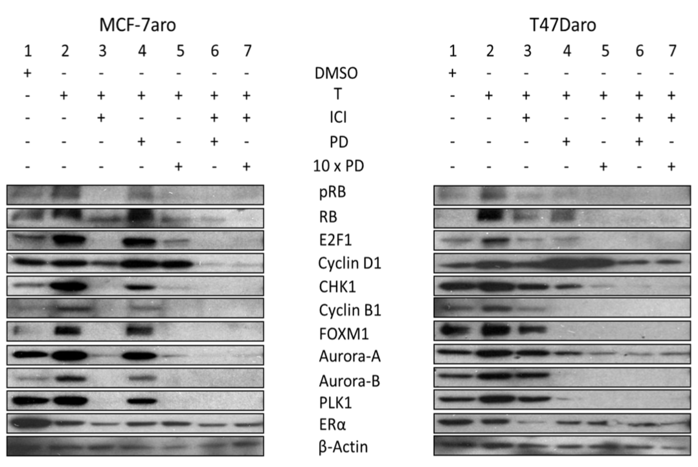

## General Information

This notebook will use my notebook from Assignment 1 as a child document, so I 
can share code chunks across different projects. The document used will not be 
the entire Assignment 1 notebook but a shortened copy of it, which I named 
"A1_copy.Rmd". The information from Assignment 1 will be under 
**Recap of Assignment 1**. An introduction to the data and the paper will be in 
the "Introduction" section under **Recap to Assignment 1**. To skip this 
section, please navigate to **Introduction to Assignment 2**. The answers to the 
questions that are not a part of the Interpretation section will highlighted be 
in **bold syntax**.


## Recap of Assignment 1

```{r child='A1_copy.Rmd', include=FALSE, eval=TRUE}
```


## Introduction to Assignment 2

The goal of this assignment is to take the normalized expression data from 
Assignment 1 and rank the genes in the dataset according to the differential 
expression. After the list of genes is ranked, I will perform a thresholded 
over-representation analysis to highlight dominant themes in the top set of 
genes. The orginal dataset I'm using, as mentioned above, consists of the data 
the authors obtained on MCF-7aro and C4-12ERaERE cell lines. These cell lines 
were treated with either DMSO (control) or estrogen (E2). There is also data on 
MCF-7aro cell line treated with Paroxetine/Paroxetine+E2; however, those 
replicates may not have been used by the authors in the study because they were 
not mentioned in the paper. RNA-seq analysis was done on the replicates to see 
whether estrogen stimulates gene expression changes in the two cell lines and 
consequently involved in cell cycle progression. The goal was to determine the 
need of estrogen receptor in cell cycle progression which can identify tumors 
that will respond to CDK4/6 inhibitors [@petrossian2018].

I used BiocManager [@BiocManager], edgeR [@edgeR], limma [@limma], and 
ComplexHeatmap [@ComplexHeatmap] for this assignment. To install these packages:
```{r}
if (!requireNamespace("BiocManager", quietly = TRUE))
    install.packages("BiocManager")
if (!requireNamespace("edgeR", quietly = TRUE))
    BiocManager::install("edgeR")
if (!requireNamespace("limma", quietly = TRUE))
    BiocManager::install("limma")
if (!requireNamespace("ComplexHeatmap", quietly = TRUE))
    BiocManager::install("ComplexHeatmap")
```


## Differential Gene Expression

Currently, my dataframe contains 18 columns, representing the 18 replicates. 
However, the dataset also contains two extra columns on the MCF-7 cell line that 
was treated using Paroxetine and Paroxetine+E2. In the paper, there was no 
mention of the paroxetine treatment, and the main treatments used in the 
experiments were DMSO as the control and E2. Thus, I decided to focus on the 
cell lines that had those two treatments and removed the Paroxetine related 
columns.
```{r}
interestedReplicates <- colnames(logNormalized)[grepl(
  "E2_", colnames(logNormalized)) | grepl("DMSO", colnames(logNormalized)) | 
    grepl("C4.12", colnames(logNormalized))]
expData <- logNormalized[, interestedReplicates]
head(expData)
```

Below is a MDS plot of the normalized data. This will help me define my model 
design that I will use to calculate differential expression. The colour scheme 
is the same as the one used in Assignment 1.
```{r}
plotColours <- rep(c("#CC0000", "#660000", "#66CC33", "#006600"), each = 3)
legendNames <- c("C4.12_control", "C4.12+E2", "MCF-7aro_control", "MCF-7aro+E2")

limma::plotMDS(expData, col = plotColours, main = "MDS Plot After Normalization")
legend("topleft", legend = legendNames, fill = c("#CC0000", "#660000", 
                                                 "#66CC33", "#006600"))
```

Looking at the MDS plot, the C4-12ERaERE and MCF-7aro cell lines are clearly 
separated on the x-axis. The control replicates and the estrogen (E2) treated 
C4-12ERaERE replicates are clustered together, while the MCF-7aro control and E2 
treated replicates are separated along the y-axis. Also, the replicates all 
clustered together, so there was little variation in the gene expression among
them. Thus, the cell type and the different treatments play an important role in
determining gene expression, while the replicates do not seem to make much of 
difference. 


Firstly, I will define a model design that will be used to calculate differential 
expression. Since my data depends mainly on the cell lines and the treatments, I
want to make a dataframe to classify the different cell lines while taking into 
account the different treatments used. I tried using the code from lecture 4/5 
to define the groups, but the naming of the cell lines are not consistent. So, 
I tried adapting the code to suit my dataset.
```{r}
samples <- data.frame(cell_type = rep(c("C4.12ERaERE", "MCF-7aro"), each = 6), 
                      treatment = rep(c("DMSO", "E2"), each = 3, times = 2))
rownames(samples) <- colnames(expData)
samples

# create model matrix
model_design <- model.matrix(~samples$cell_type + samples$treatment)
model_design
```

I chose to use Quasi Likelihood from edgeR [@edgeR] to calculate the p-values. 
Since I removed six columns that contained data on the paroxetine treatments, I 
had to remove the corresponding columns from my filtered_data_matrix in 
Assignment 1. I took the first 12 columns using `filter_data_matrix[,1:12]` 
since the paroxetine data was in the last 6 columns.
```{r}
edgeRexp <- edgeR::DGEList(counts = filtered_data_matrix[,1:12], 
                           group = samples$cell_type)
dispersion <- edgeR::estimateDisp(edgeRexp, model_design)
dispersion <- edgeR::calcNormFactors(dispersion)
fit <- edgeR::glmQLFit(dispersion, model_design)
differential_expression <- edgeR::glmQLFTest(fit, 
                                             coef = 'samples$cell_typeMCF-7aro')
data.frame(edgeR::topTags(differential_expression))
```

**I chose to correct the p-values using Benjamini-Hochberg correction because 
it is the most commonly used multiple hypothesis testing method and is used in 
lecture and in the homework. BH is also the method that the authors of the paper
used, which was mentioned in the Methods section [@petrossian2018].** 
```{r}
differential_results <- edgeR::topTags(differential_expression, 
                                       adjust.method = 'BH', 
                                       sort.by = "PValue", 
                                       n = nrow(expData))
```

Next, I filtered for the genes that were significantly expressed. **I used a 
threshold p-value of 0.05 and FDR of 0.05 because 0.05 is commonly used and was 
also used in lecture and in the homework.**
```{r}
length(which(differential_results$table$PValue < 0.05))
length(which(differential_results$table$FDR < 0.05))
```

**Using a p-value of 0.05 as a threshold, there are 13088 significant genes, and 
using a FDR of 0.05, there are 13026 significant genes.** Just by looking at the 
numbers above, most of the genes in the normalized data passed the p-value and 
FDR threshold,which is a bit questionable. Thus, I decided to filter it more by 
adding another threshold on the fold change. **I added a threshold for log-fold 
change of |fold-change| > 1.5.** This is supported by the paper, as this was 
what the authors also did [@petrossian2018].
```{r}
length(which(differential_results$table$PValue < 0.05 & 
               abs(differential_results$table$logFC) > 1.5))
length(which(differential_results$table$FDR < 0.05 & 
               abs(differential_results$table$logFC) > 1.5))
sum(differential_results$table$FDR < 0.05 & 
               abs(differential_results$table$logFC) > 1.5) / nrow(expData)
```

**Now, there are 5193 significant genes using a p-value of 0.05 and absolute 
log fold-change of at least 1.5, and there are 5193 significant genes using a 
FDR of 0.05 and absolute log fold-change of at least 1.5, which is around 34% of 
the normalized dataset.**

Next, I graphed the results from the BH calculations onto a MA plot of all the 
genes in the dataset. I wanted to sort the differentially expressed significant 
genes from the not differentially expressed ones. In the code below, I used 
`limma::plotMD()` instead of `limma::plotMA()` because both functions create a 
MA plot, and `plotMD()` adds colour coding for highlighted points. The code in 
the chunk below is not completely my own work.
```{r}
# re-organize the order of the genes in differential_results to match the order
# in the differential_expression data. Without this step, the differentially 
# expressed genes will be a blob on the plot because the order does not match
differential_results_copy <- differential_results[rownames(differential_expression), ]

# create a character vector of all the genes in differential_results_copy with 
# the appropriate classification
highlight <- apply(differential_results_copy$table, 1, FUN = function(symbol) {
  if (abs(symbol["logFC"]) > 1.5 && symbol["FDR"] < 0.05) {
    return("Differentially expressed")
  } else {
    return("Not differentially expressed")
  }
})

# plot mean-dispersion plot (aka MA plot)
limma::plotMD(differential_expression, status = highlight, cex = 0.5, 
              main = "MA Plot of Differentially Expressed Genes")
```

The next step of the assignment is to visualize the top hits using a heatmap. 
In the code below, I created a set of all the significant genes with p-value of 
0.05 and absolute log fold-change of at least 1.5, so the heatmap will be of the 
expression values of all 5193 significant genes.
```{r message=FALSE}
top_hits <- rownames(differential_results$table)[
  differential_results$table$FDR < 0.05 & 
    abs(differential_results$table$logFC) > 1.5]
top_hits <- expData[top_hits, ]
top_hits <- t(scale(t(top_hits)))
heatmap_colour = circlize::colorRamp2(c(min(top_hits), 0, 
                                          max(top_hits)), 
                                      c("blue", "white", "red"))
ComplexHeatmap::Heatmap(as.matrix(top_hits), 
                        cluster_rows = TRUE,
                        cluster_columns = TRUE, 
                        show_row_dend = TRUE, 
                        show_column_dend = TRUE, 
                        col = heatmap_colour, 
                        show_column_names = TRUE, 
                        show_row_names = FALSE, 
                        show_heatmap_legend = TRUE)
```

**There is very significant clustering in the heatmap. The clustering is mainly 
from the difference in the cell lines. This is consistent with what was shown in 
the MDS plot, which showed the groups mostly separated based on cell line 
differences. This also is consistent in terms of biological variation between 
different cell lines.**

Next, I stored the data so that I can use it in later steps of the assignment. 
I separated the up-regulated genes and the down-regulated genes from the 
significantly expressed genes. To find the up-regulated genes, I used a logFC 
value of at least 1.5, and the down-regulated genes had a logFC value of at most 
-1.5. For both up- and down-regulated genes, they must have a FDR value of at 
least 0.05.
```{r}
# up-regulated genes
upregulated_genes <- rownames(differential_results$table)[
  differential_results$table$FDR < 0.05 & differential_results$table$logFC > 1.5]
upregulated_genes <- expData[upregulated_genes, ]

# down_regulated genes
downregulated_genes <- rownames(differential_results$table)[
  differential_results$table$FDR < 0.05 & differential_results$table$logFC < -1.5]
downregulated_genes <- expData[downregulated_genes, ]

# all the significant differentially expressed genes
significant_genes <- rbind(upregulated_genes, downregulated_genes)

# export
write.table(x = rownames(upregulated_genes), 
            file = "upregulated_genes.txt", sep = "\t", 
            row.names = FALSE, col.names = FALSE, quote = FALSE)
write.table(x = rownames(downregulated_genes), 
            file = "downregulated_genes.txt", sep = "\t", 
            row.names = FALSE, col.names = FALSE, quote = FALSE)
write.table(x = rownames(significant_genes), 
            file = "all_differentially_expressed_genes.txt", sep = "\t", 
            row.names = FALSE, col.names = FALSE, quote = FALSE)
```


## Thresholded Over-Representation Analysis

For the thresholded over-representation analysis, I used the same method as the 
one used in [Homework 2](https://github.com/bcb420-2021/Student_Wiki/wiki#homework-assignment---due-march-9-2021). 
**I ran a [g:profiler](https://biit.cs.ut.ee/gprofiler/gost) enrichment analysis 
using g:GOST [@g:Profiler]. I decided to use g:profiler [@g:Profiler]because 
I've used it in the homework assignment and I am familiar with how to use it.** 
In the methods section, the authors stated that GO category enrichment analysis 
was performed with DAVID [@petrossian2018], but g:GOST does not have that option. 
**The data sources I used were GO biological process, KEGG, Reactome, and 
WikiPathways with Benjamini-Hochberg as the multiple hypothesis testing method. 
The data sources are the same ones that I used in the homework assignment, which 
was why I chose them. Another reason is that I am interested in the biological 
processes, molecular interactions, and gene ontology.**

**The versions of the annotations I used, which are found under the "Data 
sources" --> "Show data versions" tab: GO:BP – annotations: BioMart classes: 
releases/2020-12-08; KEGG – KEGG FTP Release 2020-12-14; REAC – annotations: 
BioMart classes: 2020-12-15; WP – 20201210**

The text files that were exported in the section above consisted of the HGNC 
symbols of the differentially expressed genes. When I was running  g:profiler 
using those files, there were a number of genes that had multiple Ensembl IDs. 
I did two runs in g:profiler for each .txt file, one with the ambiguous genes 
matched to the Ensembl ID with the most GO annotations and another ignoring all 
ambiguous genes. There were some ambiguous genes that had 0 GO annotations for 
all of the Ensembl IDs, so I chose to ignore those genes (DDX11L2, DGCR5, 
PRICKLE2-AS1, SFTA3, SNORA63, SNORA70, SNORA72, SNORD28, SNORD30, SNORD33, 
SNORD38B, SNORD63, SNORD81).

**For all of the analyses below, I set the "Significance threshold" to Benjamini-
Hochberg FDR and the "User threshold" to 0.05.**


### All Differentially Expressed Genes

**There was 1086 GO biological process (GO:BP) genesets, 46 KEGG genesets, 46 
Reactome (REAC) genesets, and 24 WikiPathways (WP) genesets out of the 5193 
differentially expressed significant genes. This data includes the ambiguous 
genes that have GO annotations.**


**Without the ambiguous genes, the results are actually different, which was 
interesting. The number of genesets increased for all the data sources: 1116 
GO:BP genesets, 49 KEGG genesets, 47 REAC genesets, and 25 WP genesets**


The top 15 GO:BP terms in the combined differentially expressed genes, including 
the ambiguous genes (top term: anatomical structure development; adjusted 
p-value: 7.146x10-50):


The top 15 GO:BP terms in the combined differentially expressed genes, without 
the ambiguous genes (top term: system development; adjusted p-value: 
2.392x10-51):


The top 15 KEGG terms in the combined differentially expressed genes, including 
the ambiguous genes (top term: pathways in cancer, adjusted p-value: 4.380x10-9):


The top 15 KEGG terms in the combined differentially expressed genes, without 
the ambiguous genes (top term: pathways in cancer, adjusted p-value: 2.474x10-9):


The top 15 REAC terms in the combined differentially expressed genes, including 
the ambiguous genes (top term: pathways in cancer, adjusted p-value: 2.934x10-9):


The top 15 REAC terms in the combined differentially expressed genes, without 
the ambiguous genes (top term: pathways in cancer, adjusted p-value: 1.917x10-9):


The top 15 WP terms in the combined differentially expressed genes, including 
the ambiguous genes (top term: pathways in cancer, adjusted p-value: 8.072x10-4):


The top 15 WP terms in the combined differentially expressed genes, without 
the ambiguous genes (top term: pathways in cancer, adjusted p-value: 7.673x10-4):


**Compared to the data from the up- and down-regulated genes, the GO:BP, KEGG, 
and WP terms are the most in the all differentially expressed genes, while it 
has less REAC terms than the down-regulated genes.**


### Up-Regulated Genes

**In total, there were 2482 up-regulated genes in the 5193 significant genes. 
Out of the 2482 genes, there were 139 GO:BP genesets, 2 KEGG genesets, 2 REAC 
genesets, and no WP genesets (143 terms overall). This includes the ambiguous 
genes.**


**Excluding the ambiguous genes, the number of KEGG, REAC, and WP genesets did 
not change. Only GO:BP genesets changed from 139 to 155 genesets, adding up to 
159 genesets in total.**


The top 15 GO:BP terms in the up-regulated genes, with the ambiguous genes (top 
term: cell adhesion, adjusted p-value: 2.073x10-12):


The top 15 GO:BP terms in the up-regulated genes, without ambiguous genes (top 
term: biological adhesion, adjusted p-value: 1.767x10-12):


The top 2 KEGG terms in the up-regulated genes, with the ambiguous genes (top 
term: AGE-RAGE signaling pathway in diabetic complications, adjusted p-value: 
3.999x10-2):


The top 2 KEGG terms in the up-regulated genes, without ambiguous genes (top 
term: cAMP signaling pathway, adjusted p-value: 3.720x10-2):


The top 2 REAC terms in the up-regulated genes, with the ambiguous genes (top 
term: cell-cell junction organization, adjusted p-value: 2.454x10-2):


The top 2 REAC terms in the up-regulated genes, with the ambiguous genes (top 
term: cell-cell junction organization, adjusted p-value: 2.391x10-2):


**In general, the number of terms from the up-regulated genes is the least among 
the total and down-regulated genes.**


### Down-Regulated Genes

**In total, there were 2711 down-regulated genes in the 5193 significant genes. 
Out of the 2711 genes, there were 997 GO:BP genesets, 39 KEGG genesets, 61 REAC 
genesets, and 21 WP genesets (1118 genesets overall). This includes the 
ambiguous genes.**


**Excluding the ambiguous genes, the number of KEGG and WP genesets did not 
change. The GO:BP and REAC genesets changed from 997 to 1008 genesets and from 
61 to 65 genesets, respectively, which adds up to 1133 genesets in total.**


The top 15 GO:BP terms in the down-regulated genes, with ambiguous genes (top 
term: nervous system development, adjusted p-value: 8.190x10-43):


The top 15 GO:BP terms in the down-regulated genes, without ambiguous genes (top 
term: nervous system development, adjusted p-value: 2.239x10-43):


The top 15 KEGG terms in the down-regulated genes, with ambiguous genes (top 
term: pathways in cancer, adjusted p-value: 1.214x10-7):


The top 15 KEGG terms in the down-regulated genes, without ambiguous genes (top 
term: pathways in cancer, adjusted p-value: 7.349x10-8):


The top 15 REAC terms in the down-regulated genes, with ambiguous genes (top 
term: L1CAM interactions, adjusted p-value: 1.015x10-5):


The top 15 REAC terms in the down-regulated genes, without ambiguous genes (top 
term: L1CAM interactions, adjusted p-value: 8.601x10-6):


The top 15 WP terms in the down-regulated genes, with ambiguous genes (top 
term: NOTCH1 regulation of human endothelial cell calcification, adjusted 
p-value: 6.712x10-3):


The top 15 WP terms in the down-regulated genes, with ambiguous genes (top 
term: NOTCH1 regulation of human endothelial cell calcification, adjusted 
p-value: 6.462x10-3):


**There are more terms from the down-regulated genes than from the up-regulated 
genes. The top terms for the different data sources were mostly the same with or 
without the ambiguous genes.**


## Interpretation

1. Do the over-representation results support conclusions or mechanism discussed 
in the original paper?

    As mentioned above, the top differentially expressed genes that were 
    up-regulated from the over-representation results are genes labelled as 
    "cell adhesion", "biological adhesion", "AGE-RAGE signaling pathway", "cAMP 
    signaling pathway", and "cell-cell junction organization". The top down-
    regulated genes are labelled as "nervous system development", "pathways in 
    cancer", "L1CAM interactions", and "NOTCH1 regulation of human cell 
    calcifiaciton". The goal of the paper was to determine the need of estrogen 
    receptors in cell cycle progression which can identify tumors that will 
    respond effectively to CDK4/6 inhibitors [@petrossian2018]. One of the 
    findings was that transcriptionally function ER does not affect cell cycle 
    progression, which was shown using the C4-12 cell line transfected with 
    functional ER [@petrossian2018]. However, the MCF-7 cell line showed 
    up-regulation of cell cycle genes upon estrogen treatment, confirming that 
    estrogen is a driving factor of cell cycle progression for this cell line. 
    The authors then tested the effect of CDK4/6 inhibitors (palbociclib) in 
    combination with fulvestrant (ICI) on MCF-7aro cells. Through Western Blot, 
    it was shown that ICI significantly reduced protein production in MCF-7aro, 
    and when treated in combination with palbociclib, the cell cycle progression 
    proteins were drastically reduced in MCF-7aro cells [@petrossian2018], as 
    observed in lane 6 of Figure 2B. 
    
    
    
    In conclusion, the paper showed that the C4-12 cell line that did not need 
    estrogen for cell cycle progression did not respond to any treatment 
    (estrogen and palbociclib), and there was up-regulation of ER regulated cell 
    cycle genes only in the MCF-7 cell line, which was estrogen dependent. In 
    addition, only the estrogen-dependent with active ER cell lines showed a 
    response to the treatments. Thus, transcriptionally function ER involved in 
    cell cycle progression is needed for CDK4/6 response.
    
    Although the paper did not mention the results I got from the 
    over-representation analysis, the top terms from the up-regulated genes can 
    be related to cell cycle progression. Cell adhesion affects mitosis and 
    changes in a cell-cycle-dependent manner [@cellAdhesion]. AGE-RAGE signaling 
    activates MAPKs, which regulates cell cycle during meiosis and is also 
    involved in the signal transduction pathways leading to mitosis [@MAPK]. 
    cAMP has been shown to inhibit decay of CDK inhibitor p27 and delay S phase 
    of cell cycle [@cAMP]. Since the top up-regulated genes are all related to 
    cell cycle progression and I was comparing the MCF-7aro cell line in E2 
    treatment, this is consistent with the conclusion in the original paper.
    

2. Can you find evidence, i.e. publications, to support some of the results that 
you see. How does this evidence support your results?

    There is a review paper written in 1998 that highlights the importance of 
    estrogen and its role in regulating expression of c-Myc and cyclin D1 and 
    activating cyclin E-Cdk2 [@estrogen1998]. Expression of these genes are the 
    rate limiting step for the cell cycle progression from G1 to S phase. The 
    paper also mentioned that breast cancer cell growth was arrested with 
    treated with pure antiestrogen and cell cycle was reinitiated with estrogen 
    [@estrogen1998]. Another paper in 2003 also did an investigation into 
    estrogen and antiestrogen regulation of cell cycle. They found that insulin 
    and estrogen synergistically stimulate cell cycle progression 
    [@antiestrogen2003]. Additionally, they treated MCF-7 with an antiestrogen 
    treatment, which lead to a major decrease of c-Mcy expression and a 
    subsequent decrease in cyclin D1, and cell cycle progression was arrested 
    [@antiestrogen2003]. This corresponds with the evidence shown in the 
    original paper [@petrossian2018] and with my results. The authors found an 
    up-regulation of cell cycle genes in the MCF-7 cell line after treating it 
    with estrogen, and the MCF-7aro cells showed a decrease in cyclin D1 with 
    subjected to palbociclib and ICI. As stated in the secion above, the top 
    terms from the up-regulated differentially expressed genes can all be 
    related to cell cycle progression. Since the 2003 paper did an similar 
    experiment by treating MCF-7 cells to pure antiestrogen, their results 
    should be opposite from mine. This is evident in the analysis of the 
    up-regulated cells. All of the top terms from the up-regulated cells have a 
    connection to regulation of cell cycle progression.


## Citations