## Introduction to Assignment 3

I selected the dataset 
[GSE114260](https://www.ncbi.nlm.nih.gov/geo/query/acc.cgi?acc=GSE114260), named 
"Effect of estrogen (E2) treatment on the C4-12 relative to the MCF7 cells" from 
a 2018 paper ["ERα-mediated cell cycle progression is an important requisite for 
CDK4/6 inhibitor response in HR+ breast 
cancer"](https://pubmed.ncbi.nlm.nih.gov/29963233/) [@petrossian2018] for this 
assignment. I chose this dataset because I did an assignment on 
the effects of estrogen receptors in Alzheimer's Disease last semester, and I 
will be doing a cancer related project in the coming summer. I wanted to 
continue on the topic of estrogen receptors and estrogen treatment and dins a 
dataset that would combine that with cancer.

On the GEO page for this study, there were two file that was linked to the paper. 
The dataset I choose had combined data from MCF-7, and the other only had the 
data for the new variants (C4-12ERaERE) that the authors used. The experiment 
was done on MCF-7aro (ER+ cell line) and C4-12ERaERE (ER lacking cell line 
transfected with transcriptionally functional ER) with human cells. The C4-12 
cell line is a variant of the MCF-7 that lacks an endogenous ER alpha (ERa) and 
was used for RNA analysis [@petrossian2018]. The treatment group was given a 
palbociclib and estrogen treatment and the control was treated with DMSO. Both 
the control and the treatment group recieved the treatment for 3 days.

The conclusion from the paper was that transcriptionally functional ER that is 
involved in cell cycle is required for CDK4/6 inhibitor response 
[@petrossian2018]. In the C4-12 cell line, they transfected the cells with a 
transcriptionally function ER, but it was shown that the ER that was transfected 
was not involved in cell proliferation. The C4-12ERaERE cell line was subjected 
to an estrogen or DMSO (control) for five days [@petrossian2018]. There was no 
change in the cell vitality in the experimental group, as shown in Supplementary 
Figure 1 below. 


The authors then used the C4-12ERaERE and MCF-7aro cell lines from the data to 
test the response to palbociclib, a CDK4/6 inhibitor. It is known that the ER in 
MCF-7aro cell line is involved in cell cycle proliferation. As shown in Figure 
1, cell proliferation was reduced in the cell lines with an active ER that 
drives cell cycle (LTEDaro is another cell line the authors used that is not in 
the data) [@petrossian2018], while there was no major effects on the C4-12ERaERE 
cells that did not have ER involved in cell cycle progression.. This signifies 
that palbociclib response is dependent on estrogen-activated ER.


In Assignment 1, I downloaded the raw data and cleaned it by filtering out the 
outliers. Out of the 23393 genes in the raw data, 8280 outlier genes were 
filtered out. I also tried to map the HGNC symbols given in the raw data back to 
their respective ENSEMBL IDs because I did not know that the symbols given were 
already the HGNC symbols. After cleaning the data, I normalized it using 
Trimmed Mean of M-values (TMM) and compared the before and after normalization 
using box plots, density plots, and MDS plots. The final output was a dataframe 
with the gene symbols as row names (15113 genes) and 18 columns (the 18 samples).

In Assignment 2, I took the data from Assignment 1 and used edgeR [@edgeR] to 
find the differentially expressed genes. I removed the rows related to 
"Paroxetine" treatment before processing the data because it was not mentioned 
at all in the original paper. I chose to use Quasi Likelihood to calculate the 
p-values, and I selected for the significantly expressed genes using a maximum 
FDR value of 0.05 and minimum absolute value logFC of 1.5, matching the 
thresholds used in the original paper. Out of the 5193 significantly differentially
expressed genes, 2482 genes were up-regulated and 2711 were down-regulated. I 
then ran the up- and down-regulated genes separately in g:Profiler [@g:Profiler], 
which performs a thresholded over-representation analysis. While the results from 
the over-representation analysis were not directly involved in estrogen receptors, 
the pathways can all be traced back to cell cycle progression in response to E2 
and match the conclusion from the original paper. 

The objective for Assignment 3 is to preform a non-thresholded gene set 
enrichment analysis of the ranked set of genes from Assignment 2 using GSEA 
[@GSEA] and visualize the results in Cytoscape [@Cytoscape]. I will answer the 
interpretation questions at the end. The answers to the questions not included 
in the interpretation section will be indicated in **bold syntax**.


## Preparing the Data

I will be using my Assignment 2 notebook as a child document to this assignment 
so that I can share data and code chunks across different RNotebooks. I have used 
this in Assignment 2, but for Assignment 3, I will be using knitr [@knitr] to 
compile the notebook.

```{r message=FALSE, warning=FALSE, results='hide'}
if (!requireNamespace("knitr", quietly = TRUE))
    install.packages("knitr")
if (!requireNamespace("BiocManager", quietly = TRUE))
    install.packages("RCurl")

# knitr::knit_child("A2_AngelaWong.Rmd") to compile assignment 2 notebook
```

```{r include=FALSE, eval=TRUE}
knitr::knit_child("A2_AngelaWong.Rmd")
```


## Non-Tresholded Gene Set Enrichment Analysis

**I will be using GSEA v4.1.0 [@GSEA] as my method of doing the analysis.**
Before conducting the non-thresholded gene set enrichment analysis, I need to 
obtain a ranked set of genes from my Assignment 2 results. The rank is calculated 
using the sign of the logFC value and the negative log of the p-value. The 
up-regulated genes should all have positive ranking, and the down-regulated genes 
should have negative rankings.

```{r}
ranking <- -log10(differential_results$table$PValue) * 
  sign(differential_results$table$logFC)
ranked_genes <- data.frame(gene = rownames(differential_results$table), 
                           rank = ranking)
ranked_genes <- ranked_genes[order(ranked_genes$rank, decreasing = TRUE), ]
```

Below are the most 5 most up- and down-regulated genes:

```{r}
head(ranked_genes)
tail(ranked_genes)
```

In total, there are 
```{r}
nrow(ranked_genes)
```

Next, I exported the dataframe to a .rnk file to use in GSEA.

```{r}
write.table(ranked_genes, file = "ranked_genes.rnk", row.names = FALSE, 
            col.names = TRUE, quote = FALSE, sep = "\t")
```

**I will be using the genesets from [Bader Lab](http://download.baderlab.org/EM_Genesets/). 
The specific geneset I will be using is from update made on March 01, 2021 from 
"Human", and I only want the ones with the HGNC symbols.The geneset only 
contains GO Biological Process and no IEA and pathways.** The code below is 
adapted from lecture notes. RCurl package [@RCurl] was used to get the link to 
the datasets.

```{r}
gmt_url = "http://download.baderlab.org/EM_Genesets/current_release/Human/symbol/"

filenames = RCurl::getURL(gmt_url)
textConn = textConnection(filenames)
contents = readLines(textConn)
close(textConn)

rx = gregexpr("(?<=<a href=\")(.*.GOBP_AllPathways_no_GO_iea.*.)(.gmt)(?=\">)", 
              contents, perl = TRUE)
gmt_file = unlist(regmatches(contents, rx))
download.file(paste(gmt_url, gmt_file, sep = ""), destfile = "GOBP_AllPathways_no_GO_iea.gmt")
```

In the GSEA GUI, I first loaded the two files obtained above in the "Load Data" 
tab. I then ran GSEA on the pre-ranked gene list in the "Run GseaPreranked" tab. 
**The settings for the parameters are the same as the homework on GSEA, which 
are shown in the picture below.**

    * Number of permutations: 1000
    * Collapse/Remap to gene symbols: No_Collapse
    * Enrichrim statistic: weighted
    * Max size: 200
    * Min size: 15

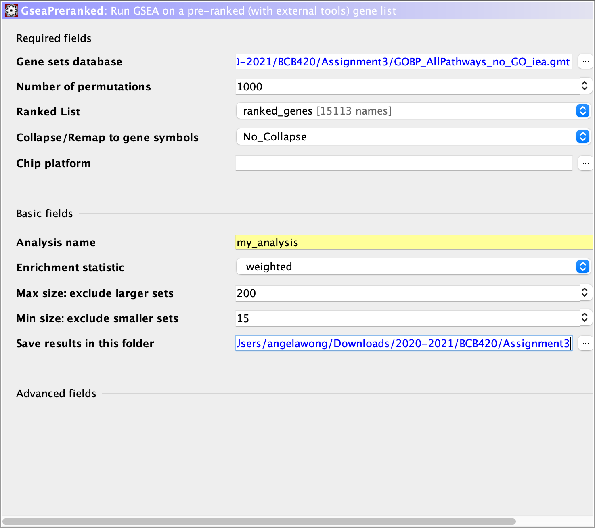

In total, there were only 5302 genesets out of the 15113 genes passed in. **Out 
of the 5302 genesets, 2487 genesets were up-regulated and 2815 genesets were 
down-regulated. Only 95 genesets in the up-regulated genes passed the threshold 
of FDR < 25%, and 428 genesets in the down-regulated genes passed FDR < 25%; 258 
genesets in the up-regulated were significantly enriched at normal p-value < 0.05, 
and 492 genesets in the down-regulated were significantly enriched at normal 
p-value < 0.05.**

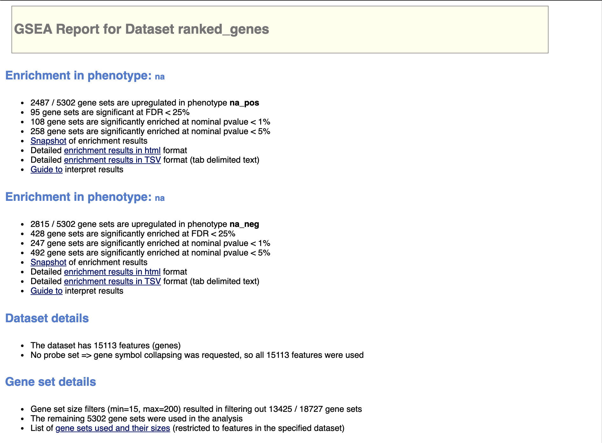

I then navigated to the "enrichment results in html" tab to see the significant 
genes for the up- and down-regulated.Below are top 10 genesets with the highest 
enrichment score for the up-regulated genes:

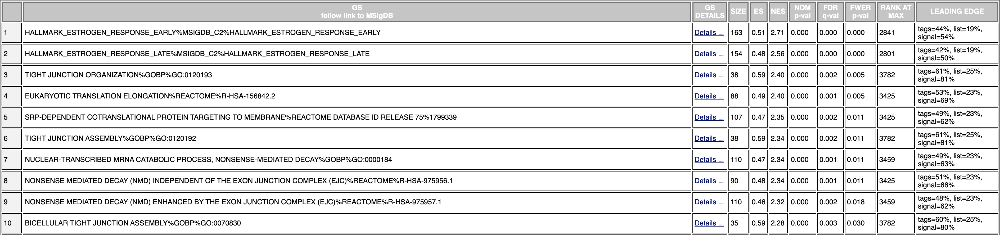

These are the top 10 genesets with the highest enrichment score for the 
down-regulated genes:

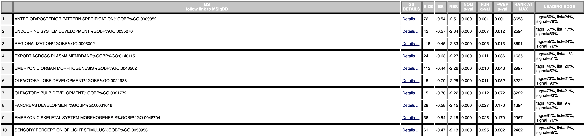

**In the up-regulated genes, the top 2 are related to estrogen response. There 
are also a few associated with tight junctions, and as I mentioned in 
Assignment 2, cell adhesion affects mitosis and changes in a cell-cycle-dependent 
manner [@cellAdhesion]. This is consistent with the up-regulated genes I 
identified in Assignment 2 using g:Profiler [@g:Profiler]. However the results 
from the down-regulated genes differed from the ones in Assignment 2. In Assignment 
2, I had "nervous system development", "pathways in cancer", "L1CAM interactions", 
and "NOTCH1 regulation of human cell calcifiaciton". From GSEA, the highest 
enrichment was from anterior/posterior pattern specification. However, looking 
at all top 10 genesets from GSEA, a few genesets are associated with nervous 
system developement, such as "olfactory lobe/bulb developement" and "sensory 
perception of light stimulus", and there is one related to cell calcification 
("embryonic skeletal system morphogenesis"). The difference in results from the 
GSEA may be because the GMT file I used in GSEA only included GO BP, while 
g:Profiler used GO BP, Reactome, KEGG, and WP.**


## Visualize Gene Set Enrichment Analysis in Cytoscape

### Issues

I encountered some issues when I was installing and using Cytoscape. The first 
being that I had a problem with opening the application initially. However, the 
issue was solved when I re-installed the application, verified that Java had 
been successfully downgraded to Java 11, and opened Cytoscape through Terminal 
using `./cytoscape.sh`. The second issue I had was when I was using EnrichmentMap. 
An error kept coming up saying that "none of the genes in the rank file are 
found in the expression file". I tried re-downloading the data from my GSEA 
analysis, which did not work, and tried to re-run GSEA and EM. Someone in the 
[cytoscape helpdesk](https://groups.google.com/g/cytoscape-helpdesk/c/2DAilTErs1g/m/L3YXPEErAgAJ) 
had the same issue as me, so I tried to follow their steps on fixing the problem. 
I replaced the "ranked_gene_list_na_pos_versus_na_neg_1617739416137.txt" with 
"ranked_genes.rnk", which is the ranked gene file I generated from my Assignment 
2. This worked, but the results seem off. Because using the ranked genes from 
GSEA did not work at all, I decided to use the results generated from using 
my own ranked gene file even if the number of nodes seem suspiciously small.

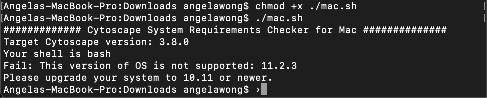

Another strange issue I had was everytime I reloaded the GSEA data into Cytoscape 
and re-ran EnrichmentMap (because cytoscape, even after I could use it, was very 
unstable and kept crashing), the results from the enrichment analysis would be 
different. For the interpretation section, I had to re-run the enrichment analysis 
because Cytoscape suddenly became unresponsive. The results from that analysis was 
different from the results I present below in this section. 

### Enrichment Analysis

I used Cytoscape v3.8.2 [@Cytoscape] in this section to visualize the results 
from GSEA. After downloading the required apps from the EnrichmentMap pipeline, 
I navigated to the "Create Enrichment Map" window from Apps --> EnrichmentMap. 
**The inputs and parameters I used were:**

**- Analysis Type: GSEA**

**- Enrichment Pos: "gsea_report_for_na_pos_1617740328725.tsv"**

**- Enrichment Neg: "gsea_report_for_na_neg_1617740328725.tsv"**

**- GMT: "GOBP_AllPathways_no_GO_iea.gmt"**

**- Ranks: "ranked_genes.rnk"**

**- Positive phenotype: na_pos**

**- Negative phenotype: na_neg**

**- FDR: 0.05**

**- p-value: 1.0 (Default)**

**- Data Set Edges: Automatic (Default)**

**- Connectivity: midway between dense and sparse (Default)**

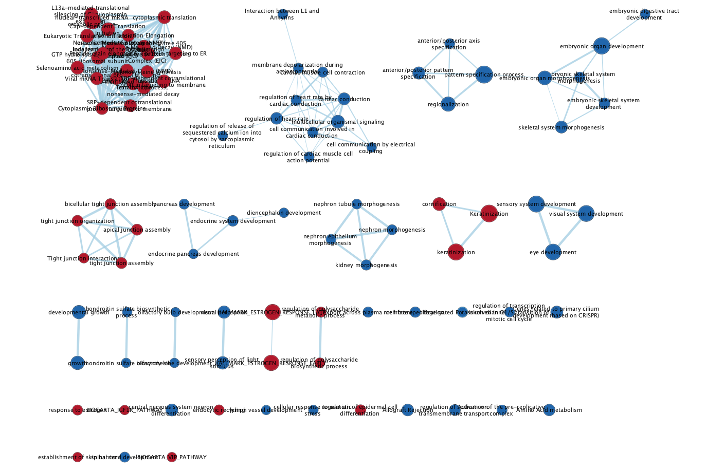

**The network contains 94 nodes and 331 edges. The result is drastically different 
from the GSEA analysis most likely because of the rank file I used. Since the 
rank file is from my Assignment 2 data and not the one generated from GSEA, this 
may have caused the results to be very different. However, this was the only 
solution I have found to generate an enrichment map with a rank file. I did try 
to generate an enrichment map without inputting a rank file, but the resulting 
network had even less nodes (88)**

For the annotated network, I used the AutoAnnotate app and used the default 
parameters to create the graph below. The parameters were: 

**- Annotate entire network selected**

**- Label columns set to GS_DESCR**

**- Use clusterMaker App**

**- MCL Cluster and the edge weight column set to similarity_coefficient**

**- Create singleton clusters not selected**

**- Label with WordCloud's Adjacent Words**

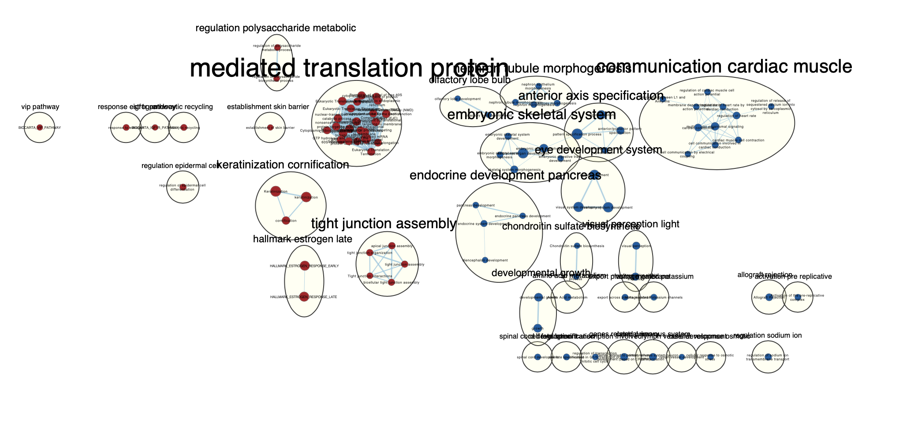

The largest cluster for the up-regulated terms, mediated translation protein, 
contained 23 genesets, and the largest down-regulated clustered was 
communication cardiac muscle, with 11 genesets. 

The collapsed annotated network:
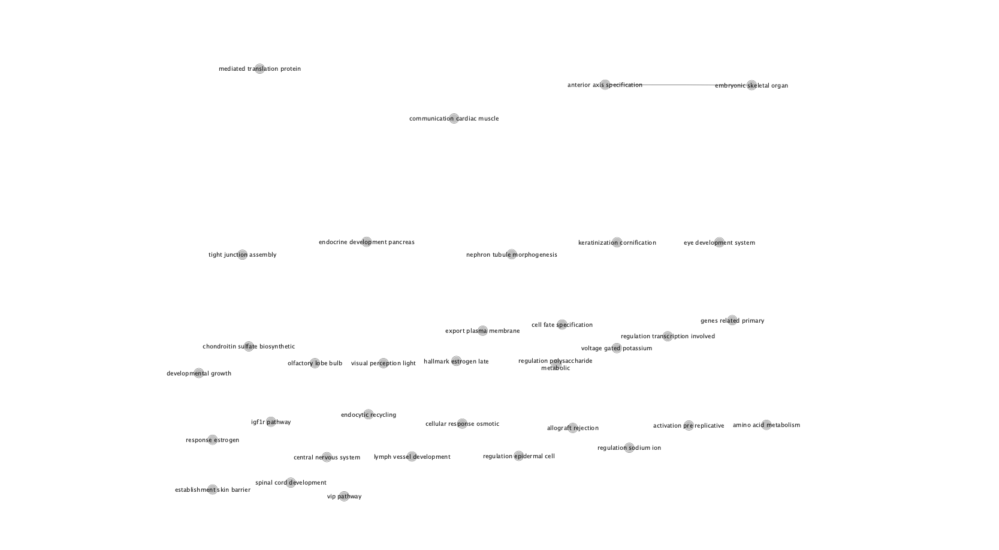

The publication ready network:
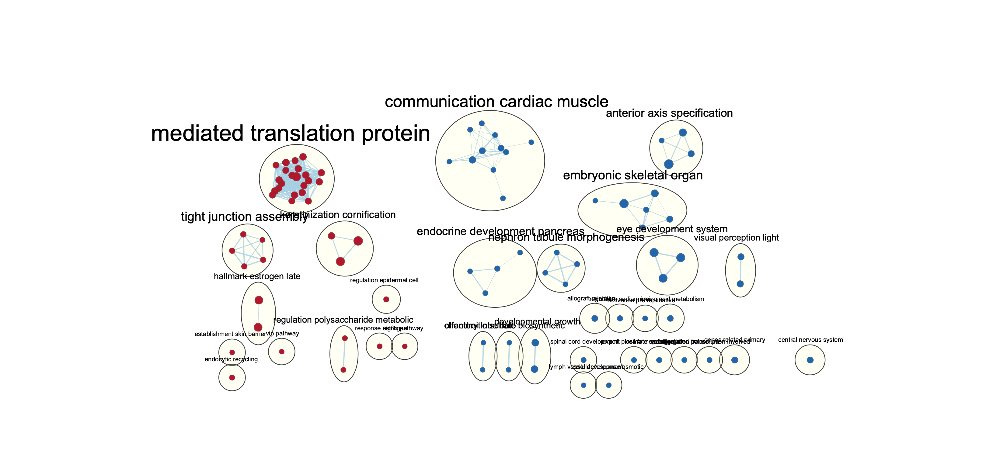
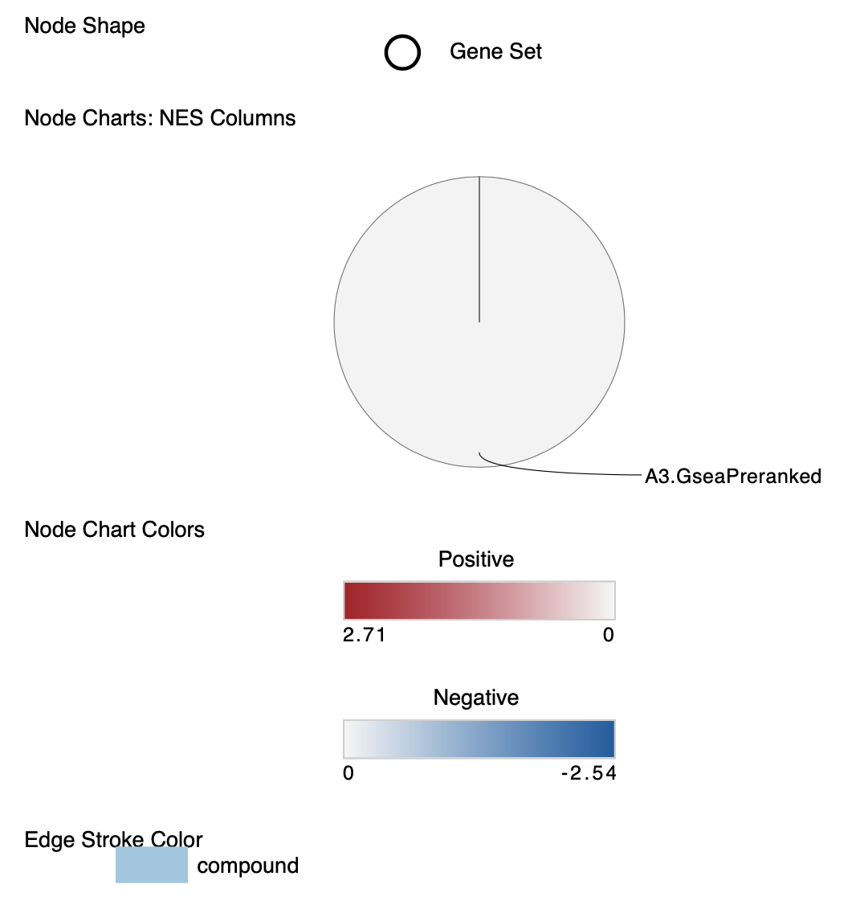

## Interpretation

1. Do the enrichment results support conclusions or mechanism discussed in the 
original paper? How do these results differ from the results you got from 
Assignment #2 thresholded methods

    The conclusion from the enrichment results greatly deviates from the results 
    in the original paper. This is caused by the incorrect rank file I had to 
    use to avoid an error that occured everytime I tried to generate an 
    enrichment map. Althought the most prominant clusters from the enrichment 
    anaysis does not align with the results from both the original paper and my 
    Assignment 2, there are some networks that show some semblance to the results 
    that supported the original paper. There is a significant cluster of tight 
    junction assembly genesets in the up-regulated genes that is consistent with 
    the results from thresholded g:Profiler in my Assignment 2. Tight junctions 
    and cell adhesions, as I mentioned in Assignment 2, contributes to cell 
    cycle progression, which supports the original paper's findings. 
    
2. Can you find evidence, i.e. publications, to support some of the results 
that you see. How does this evidence support your result?

    I found a review paper on mediated translation of proteins [@translation]. 
    The mediated tranlation of proteins is a factor in cell cycle progression as 
    irregularities and defective proteins can trigger the degradation of mRNA 
    [@translation], which could cause downstream effects on cell cycle progression.
    
3. Post Analysis

    I decided to do the post analysis using Drug Bank on my main network because 
    the original paper performed experiments using a CDK4 inhibitor drug called 
    palbociclib. I  selected all drugs from the Bader lab approved drug file 
    but the results were very distorted and had little meaning to them. This 
    again if most likely from the unknown problem that occurred from the application 
    unable to use the rank file generated from the GSEA analysis.
    
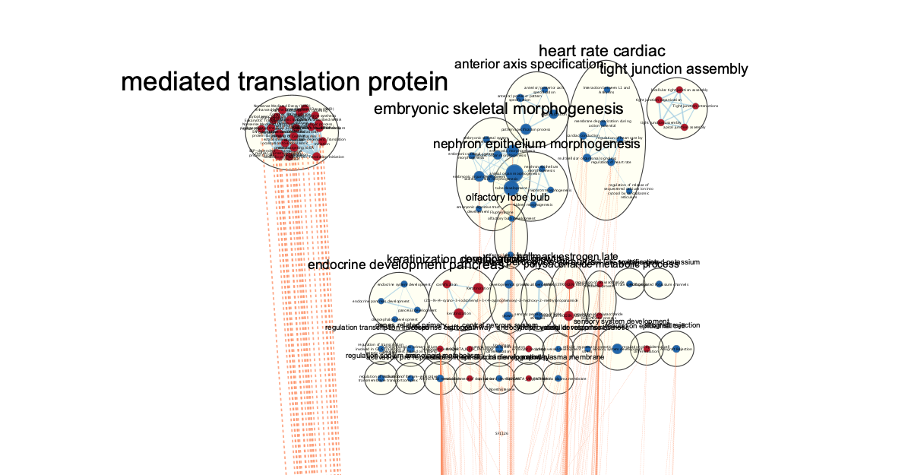


## Citations